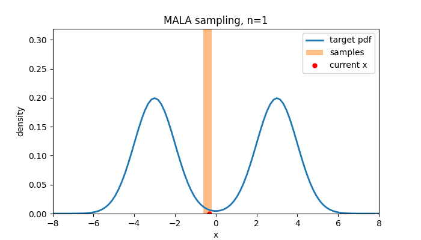
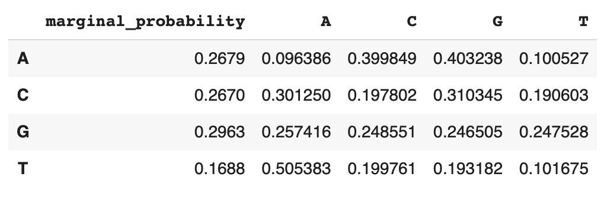
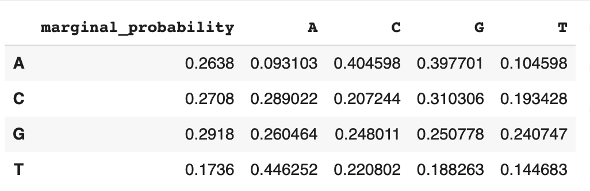

# public-playground

A public space for my experiments, notebooks, and random explorations.  

Currently includes:  

- `mala/` → illustrative notebook on the Metropolis-Adjusted Langevin Algorithm (MALA).  
    

- `acgt_lm` → a minimal language model for DNA sequences.
I coded this project to learn about language models (LLMs) and it should run efficiently on a CPU.

The architecture consists of the following components:

1. **Embedding Layers**:
   - **Token Embedding**: Embeds input tokens (DNA bases) into a `d_model`-dimensional space.
   - **Position Embedding**: Adds positional information to the token embeddings.

2. **Transformer Blocks**:
   - The model consists of `n_layers` transformer blocks.
   - Each block includes:
     - **Self-Attention**: A multi-head self-attention mechanism to capture dependencies between tokens.
     - **Multi-Layer Perceptron (MLP)**: A feed-forward network with a GELU activation function.
     - **Layer Normalization**: Applied before and after the self-attention and MLP layers.

Below are the marginal and conditional probabilities for the DNA sequences generated by the model:

### Generated Data

### Original Data

